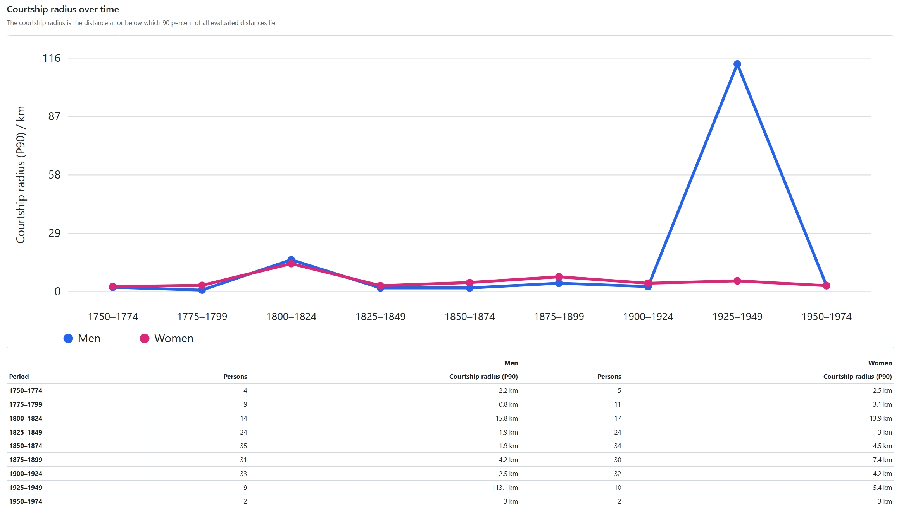
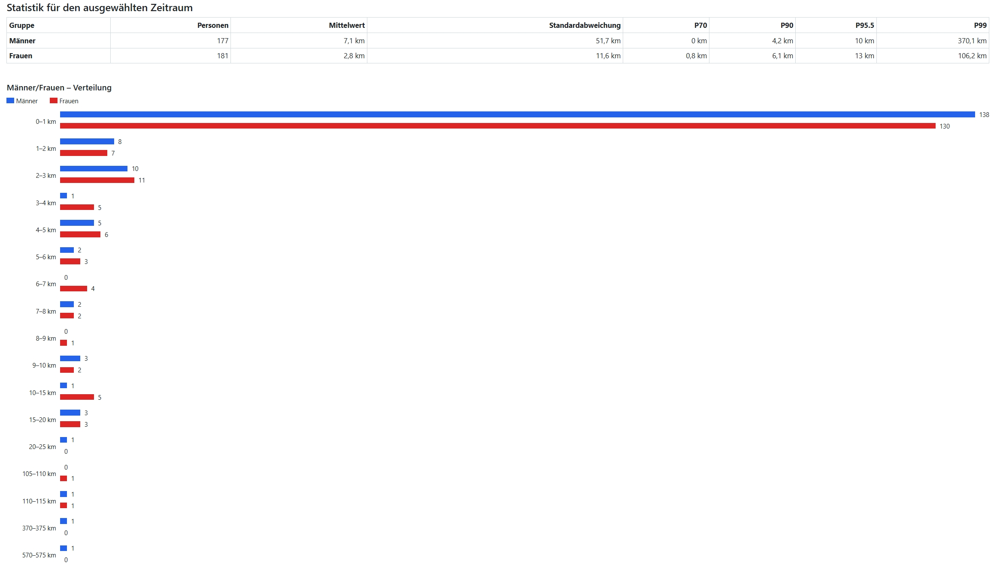
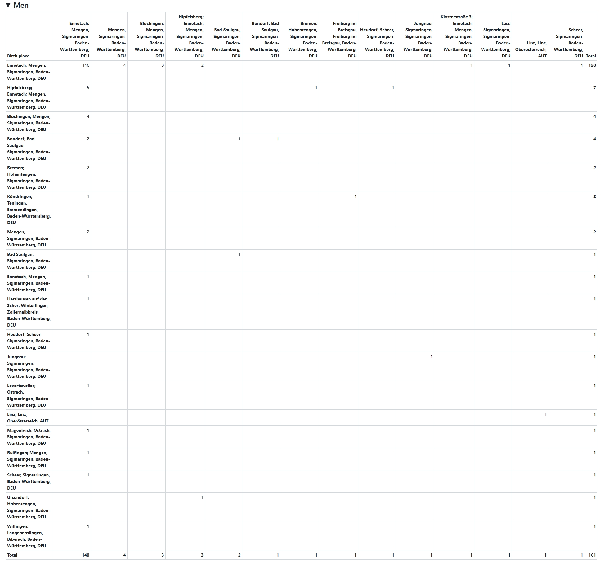
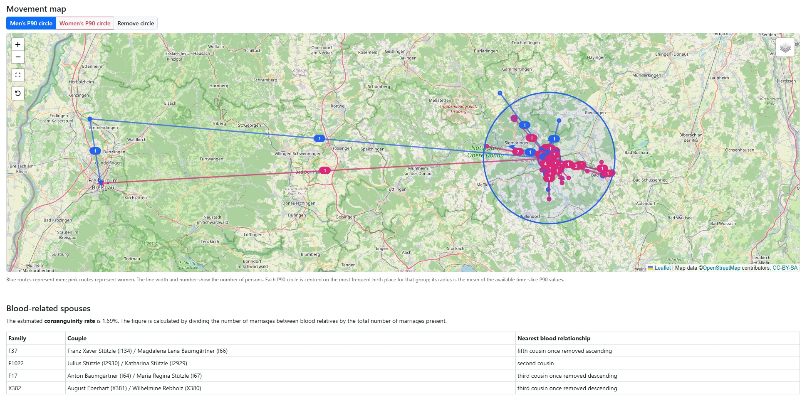
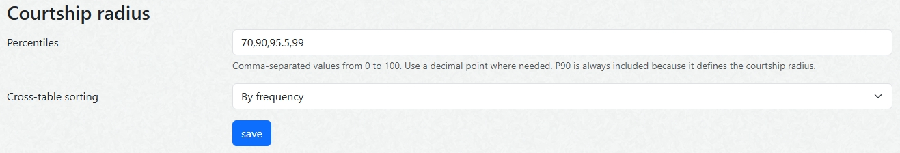

# Courtship radius for webtrees

[](http://www.gnu.org/licenses/gpl-3.0)

[](https://www.webtrees.net/)
[](https://github.com/hartenthaler/hh-courtship-radius/releases/latest)
[](https://github.com/hartenthaler/hh-courtship-radius/releases)

[](https://github.com/hartenthaler/hh-courtship-radius/actions/workflows/quality.yml)

`hh-courtship-radius` is a custom module for webtrees 2.2 that analyses how far selected men and women moved from their birthplace when forming a partnership. It shows how this geographic **courtship radius** changed over time for a population chosen by the user.

The module is intended for questions such as:

- Did most people in a village marry locally, or did marriage networks reach farther away?
- Did the typical geographic range change between generations?
- Did men and women show different movement patterns?
- Which birthplaces and marriage destinations were most strongly connected?
- How many of the evaluated marriages were between blood relatives?

The analysis is based only on families and spouses explicitly selected in the tree-specific **Clippings Cart**. It never expands the selection by adding relatives or further families.

<a name="Contents"></a>
## Contents

- [How the analysis works](#Analysis)
- [Preparing an analysis](#Preparing)
- [Reading the results](#Results)
- [Administrator settings](#Settings)
- [Data quality and limitations](#Limitations)
- [Requirements](#Requirements)
- [Installation](#Installation)
- [Privacy](#Privacy)
- [Translations](#Translations)
- [Support](#Support)
- [Credits](#Credits)
- [License](#License)

<a name="Analysis"></a>
## How the analysis works

### Exact selection from the Clippings Cart

Families are the basis of the analysis. A family is considered only if its `FAM` record is present in the Clippings Cart. At least one spouse from that family must also be present as an `INDI` record.

Only explicitly selected spouses are evaluated:

- if both spouses are explicitly selected as INDI records, the family can contribute two observations—one for each spouse;
- if only one spouse is explicitly selected, the family contributes one observation originating from that spouse’s birthplace; the other spouse may still provide the destination data;
- if either spouse is missing or not visible, the family cannot be evaluated.

The cart is specific to the current family tree and browser session. The webtrees core Clippings Cart and compatible extension modules use the same underlying cart data.

### One prioritised distance per selected spouse

For every evaluable spouse, the module uses exactly one distance. It applies the following priority and stops as soon as a usable destination with coordinates is found:

1. birthplace of the selected spouse → residence of the partner at the time of marriage;
2. birthplace of the selected spouse → place of marriage;
3. birthplace of the selected spouse → birthplace of the partner.

A partner's residence is used only when its `RESI` date range covers the marriage date. Closed `FROM … TO …` ranges and the open-ended forms `FROM …` and `TO …` are supported. An undated residence or one with only a fixed date is not assumed to describe the residence at marriage.

If none of the three distances can be determined, the spouse is excluded from the distance statistics and the reason is listed under **Data quality**.

Distances are great-circle distances between coordinates, measured in kilometres. They describe geographic separation, not a historical road, rail, or walking route.

### Coordinates

Coordinates are resolved in this order:

1. `MAP/LATI/LONG` attached directly to the event;
2. coordinates from a linked `_LOC` location record;
3. coordinates from the central webtrees place directory.

The module deliberately does not send place names to an external geocoding service. A place without stored coordinates cannot be used for a distance calculation.

### Time slices and the P90 courtship radius

The user chooses a **from year** and a **to year**. The marriage year assigns an observation to its period. The requested range is displayed as five to ten equal, rounded time slices; the displayed outer boundaries may therefore be rounded to convenient years.

The courtship radius is the nearest-rank **90th percentile (P90)** of all evaluated distances in a time slice. In plain language: at least 90 percent of the distances are at or below this value, while the longest approximately 10 percent lie above it.

The module calculates the P90 separately for men and women. The two series therefore describe the movements originating from the birthplaces of the explicitly selected male and female spouses.

Additional statistical definitions and implementation details are documented in [`docs/architecture.md`](docs/architecture.md).

<a name="Preparing"></a>
## Preparing an analysis

1. Open the family tree that contains the population to be studied.
2. Add every family to be analysed to the Clippings Cart.
3. Add the husband, wife, or both spouses whose movement should contribute to the male or female series.
4. Open **Charts → Courtship radius**.
5. Choose the first and last marriage year of the analysis period.
6. Select **View** to recalculate the report.

If the cart does not contain any `FAM` records, the module asks the user to add the families and individuals first. Remember that changing to another family tree or browser session also changes the active cart.

<a name="Results"></a>
## Reading the results

### Courtship radius over time

The time-series chart compares the male and female P90 courtship radii. The table below the chart gives the number of evaluated persons and the exact P90 for every time slice.

An unusually high point can represent a genuine long-distance marriage, but it can also have a strong effect when a time slice contains only a few observations. The number of persons should therefore always be read together with the radius.



### Statistics and combined histogram

The statistics table summarises the selected period separately for men and women. It shows the number of observations, arithmetic mean, standard deviation, P90, and any additional percentiles configured by the administrator.

The combined histogram uses the same distance classes for both groups. Blue bars represent men and red bars represent women, making their distributions directly comparable. Long-distance observations remain visible in their corresponding classes rather than being silently discarded.



### Birthplace × marriage-place cross tables

Separate collapsible cross tables are provided for men and women. Rows contain birthplaces and columns contain destinations; every cell gives the number of evaluated people for that combination. Totals are shown for rows and columns.

For readability, the heading calls the destination the **marriage place**. Depending on the available data and the priority rule, the actual destination may instead be the partner's residence at marriage or, as a fallback, the partner's birthplace.

The administrator can sort rows and columns alphabetically or by frequency.



### Movement map and P90 reference circles

The movement map displays male routes in blue and female routes in red. Routes with identical endpoints are grouped; their line width and number indicate how many observations they represent. Movements whose start and destination coordinates are effectively identical are displayed at that place without inventing a route.

The buttons above the map can show one reference circle for men and one for women:

- the centre is the most frequent birthplace of the corresponding group;
- the radius is the arithmetic mean of that group's non-empty time-slice P90 values in the displayed period.

These circles summarise the selected period. They are not administrative boundaries and do not mean that every marriage destination lies inside the circle.



### Blood-related spouses and consanguinity rate

The **Blood-related spouses** section remains present even when no related couple is found. When the relationship search finds at least one blood-related marriage, the section lists the couple, family XREF, and nearest detected blood relationship.

The displayed **consanguinity rate** is:

```text
number of marriages between blood relatives / total number of eligible marriages
```

Each eligible family is counted once in this calculation. The relationship search may inspect the whole visible tree, but it does not add records to the distance analysis.

This percentage is a population-level occurrence rate. It is not Wright's individual inbreeding coefficient and not the mean of individual inbreeding coefficients. The distinction and formulas are explained in [`docs/architecture.md`](docs/architecture.md#consanguinity-rate).

### Data quality

The **Data quality** section reports how many families and individuals were selected, how many distance observations could be evaluated, and how many cases were excluded. The collapsible exclusion table can be sorted by family, person, or reason.

Typical exclusion reasons include:

- no selected spouse in a selected family;
- missing or private partner;
- missing or unusable marriage date;
- unknown sex value;
- missing birthplace coordinates;
- no usable destination coordinates.

The evaluated-observations table shows the selected person, marriage year, birth place, destination, destination source, and calculated distance. It is useful for checking unexpected peaks or gaps before interpreting the statistics.

### CSV export

**Download statistics as CSV** creates a UTF-8 CSV file for the selected year range. The file contains:

- the privacy-filtered evaluated observations;
- statistics for men and women by time slice;
- the male and female cross tables.

The file declares the semicolon as its separator and quotes every field, so commas and semicolons in place names remain within the correct spreadsheet cell. Distances use kilometres and a decimal point so that the values can be processed reliably by spreadsheet and statistical software.

<a name="Settings"></a>
## Administrator settings

The module settings are available from the module list in the webtrees control panel.

- **Percentiles**: comma-separated values between 0 and 100; decimal values use a point. P50 is omitted, while P90 is always included because it defines the courtship radius.
- **Cross-table sorting**: sort birthplaces and destinations either by frequency or alphabetically.

The settings affect all users of the module.



<a name="Limitations"></a>
## Data quality and limitations

The report describes the selected and evaluable data, not necessarily the complete historical population. Its interpretation depends on:

- the exact records placed in the Clippings Cart;
- the completeness and visibility of spouses and marriage dates;
- the quality and precision of stored coordinates;
- dated residence information that actually covers the marriage date;
- the number of observations in every time slice.

The module uses a geographic straight-line distance on the Earth's surface. It does not reconstruct historical travel routes, journey times, political borders, or transport conditions.

<a name="Requirements"></a>
## Requirements

- webtrees 2.2;
- a Clippings Cart interface for selecting the exact `FAM` and `INDI` records to be analysed;
- stored coordinates for the relevant birth, residence, marriage, or location records;
- an enabled webtrees map provider for the movement map.

The statistical tables and CSV export remain usable when no map provider is available. Blood relationships are determined through an available Vesta relationship service or through the privacy-aware webtrees fallback.

The module has the same PHP and server requirements as the supported webtrees version.

<a name="Installation"></a>
## Installation

1. Download the ZIP file from the [latest GitHub release](https://github.com/hartenthaler/hh-courtship-radius/releases/latest).
2. Extract the archive into the `modules_v4` directory of your webtrees installation.
3. Ensure that the resulting module folder is named exactly:

   ```text
   hh-courtship-radius
   ```

4. Sign in to webtrees as an administrator.
5. Open **Control panel → Modules → All modules** and enable **Courtship radius**.
6. If required, open the module's settings page and adjust the percentiles or cross-table sorting.

After activation, **Courtship radius** is available in the chart menu of each family tree for users who have access to the chart and its underlying records.

<a name="Privacy"></a>
## Privacy

All records, names, facts, and relationships are accessed using the current visitor's webtrees permissions. Private or inaccessible data is not bypassed. The CSV export contains only observations visible to the visitor who requests it.

The statistical calculation itself does not contact an external geocoding service. Loading the movement map can, however, transmit the visitor's IP address, browser request data, and requested map area to the map provider enabled by the administrator. The module reports this provider through its privacy-notice interface for compatible legal-notice modules.

<a name="Translations"></a>
## Translations

The module currently includes:

- English source texts;
- German translations by [Hermann Hartenthaler](https://github.com/hartenthaler);
- Dutch translations contributed by [TheDutchJewel](https://github.com/TheDutchJewel).

Corrections and additional translations are welcome through a pull request or a [GitHub issue](https://github.com/hartenthaler/hh-courtship-radius/issues).

<a name="Support"></a>
## Support

- Report module-specific bugs and documentation problems in the [GitHub issue tracker](https://github.com/hartenthaler/hh-courtship-radius/issues).
- General help with webtrees is available in the [webtrees forum](https://www.webtrees.net/).

When reporting a problem, include the module version and the webtrees version.

<a name="Credits"></a>
## Credits

Developed and maintained by [Hermann Hartenthaler](https://github.com/hartenthaler) with assistance from Codex.

The idea for the module was inspired by an Roland-Info-Grafik from Heiko Hungerige:
[Der "Balzradius" in der Genealogie](https://www.roland-dortmund.de/2026/07/12/neue-roland-info-grafik-der-balzradius-in-der-genealogie/).

Thanks to the webtrees and Vesta developers and to everyone contributing tests, translations, and documentation.

<a name="License"></a>
## License

This module is licensed under the GNU General Public License, version 3 or later. See [`LICENSE`](LICENSE).
